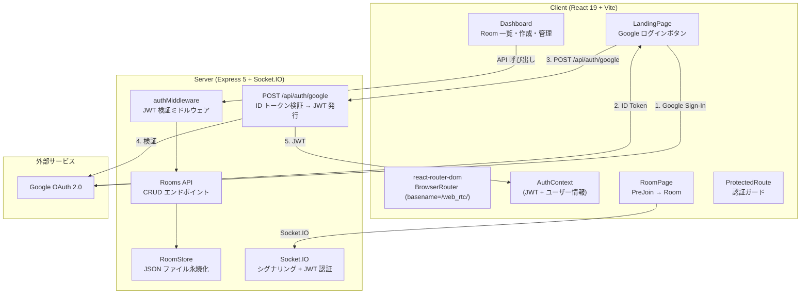
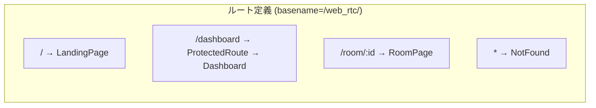

# 技術設計書: Google OAuth ログイン

## 概要

WebRTC Meet に Google OAuth ログイン機能を追加し、Room 管理者が Google アカウントで認証して Room の作成・管理を行えるようにする。同時に、現在の state ベースの画面切り替えを react-router-dom によるルーティングに移行する。

現在のアーキテクチャ:
- クライアント: React 19 + Vite（`App.tsx` の state で画面切り替え、ルーターなし）
- サーバー: Express 5 + Socket.IO（シグナリングサーバー、認証なし）
- ユーザー名は Cookie に保存

変更後のアーキテクチャ:
- クライアント: react-router-dom によるルーティング、`@react-oauth/google` による Google Sign-In、Auth Context による認証状態管理
- サーバー: `google-auth-library` による ID トークン検証、`jsonwebtoken` による JWT 発行・検証、Room 管理 REST API、JSON ファイルベースの Room データ永続化

## アーキテクチャ

### システム全体図



### ルーティング構成



- `/` : ランディングページ。認証済みなら `/dashboard` にリダイレクト
- `/dashboard` : ProtectedRoute でガード。未認証なら `/` にリダイレクト
- `/room/:id` : 認証不要。誰でもアクセス可能
- `*` : 404 ページ

### 設計判断

1. **BrowserRouter の basename**: Vite の `base: '/web_rtc/'` に合わせて `basename="/web_rtc/"` を設定。これにより全ルートが `/web_rtc/` 配下で動作する。
2. **JWT の保存先**: localStorage を使用。Cookie ベースの httpOnly トークンはサーバーが API サーバーとシグナリングサーバーを兼ねているため、シンプルな localStorage + Authorization ヘッダー方式を採用。
3. **Room データの永続化**: JSON ファイルベース。現段階ではデータベースを導入するほどの規模ではないが、将来の拡張に備えてインターフェースを抽象化する。
4. **Socket.IO の JWT 認証**: 接続時に JWT を送信するが、無効でも接続は拒否しない。Room 利用者はログイン不要のため。

## コンポーネントとインターフェース

### クライアント側

#### 1. AuthContext (`client/src/contexts/AuthContext.tsx`)

認証状態を管理する React Context。

```typescript
interface AuthUser {
  sub: string;        // Google ユーザー ID
  name: string;
  email: string;
  picture: string;
}

interface AuthContextType {
  user: AuthUser | null;
  token: string | null;
  isAuthenticated: boolean;
  isLoading: boolean;
  login: (idToken: string) => Promise<void>;
  logout: () => void;
}
```

- `login()`: ID トークンを `POST /api/auth/google` に送信し、JWT を受け取って localStorage に保存
- `logout()`: localStorage から JWT を削除し、state をクリア
- 初期化時に localStorage から JWT を読み込み、有効性を確認

#### 2. ProtectedRoute (`client/src/components/ProtectedRoute.tsx`)

```typescript
// AuthContext の isAuthenticated を確認し、未認証なら "/" にリダイレクト
// isLoading 中はローディング表示
```

#### 3. LandingPage (`client/src/pages/LandingPage.tsx`)

```typescript
// @react-oauth/google の GoogleLogin コンポーネントを使用
// ログイン成功時に AuthContext.login() を呼び出し
// 認証済みなら /dashboard にリダイレクト（useNavigate）
```

#### 4. Dashboard (`client/src/pages/Dashboard.tsx`)

```typescript
interface Room {
  id: string;
  name: string;
  createdAt: string;
  ownerId: string;
}

// Room 一覧取得: GET /api/rooms (Authorization: Bearer <JWT>)
// Room 作成: POST /api/rooms { name: string }
// Room 削除: DELETE /api/rooms/:id
// URL 共有: navigator.clipboard.writeText()
// ログアウト: AuthContext.logout() → "/" にリダイレクト
```

#### 5. RoomPage (`client/src/pages/RoomPage.tsx`)

```typescript
// useParams() で :id を取得
// Room 存在チェック: GET /api/rooms/:id/exists（認証不要）
// 存在しない場合はエラー表示
// 存在する場合は PreJoin → Room の既存フローを維持
```

#### 6. main.tsx の変更

```typescript
// BrowserRouter を追加（basename="/web_rtc/"）
// GoogleOAuthProvider でラップ（clientId は VITE_GOOGLE_CLIENT_ID）
// AuthProvider でラップ
```

### サーバー側

#### 1. 認証 API (`server/src/routes/auth.ts`)

```typescript
// POST /api/auth/google
// リクエスト: { idToken: string }
// レスポンス: { token: string, user: { sub, name, email, picture } }
// エラー: 401 { error: string }
```

処理フロー:
1. リクエストボディから `idToken` を取得
2. `google-auth-library` の `OAuth2Client.verifyIdToken()` で検証
3. ペイロードからユーザー情報を抽出
4. `jsonwebtoken` で JWT を生成（ペイロード: `{ sub, name, email, picture }`、有効期限: 7日）
5. JWT とユーザー情報をレスポンスに含めて返す

#### 2. JWT 認証ミドルウェア (`server/src/middleware/auth.ts`)

```typescript
// Authorization ヘッダーから Bearer トークンを抽出
// jsonwebtoken.verify() で検証
// 成功: req.user にデコード結果を付与、next()
// 失敗: 401 レスポンス
```

#### 3. Room 管理 API (`server/src/routes/rooms.ts`)

```typescript
// POST /api/rooms       - Room 作成（authMiddleware 必須）
// GET /api/rooms        - 自分の Room 一覧（authMiddleware 必須）
// DELETE /api/rooms/:id - Room 削除（authMiddleware 必須）
// GET /api/rooms/:id/exists - Room 存在チェック（認証不要）
```

#### 4. RoomStore (`server/src/roomStore.ts`)

```typescript
interface RoomData {
  id: string;
  name: string;
  ownerId: string;
  ownerName: string;
  createdAt: string;
  settings: Record<string, unknown>;  // 将来の拡張用
}

// load(): RoomData[] - JSON ファイルから読み込み
// save(rooms: RoomData[]): void - JSON ファイルに書き込み
// create(room: Omit<RoomData, 'id' | 'createdAt'>): RoomData
// findByOwner(ownerId: string): RoomData[]
// findById(id: string): RoomData | undefined
// remove(id: string): boolean
```

#### 5. Socket.IO JWT 認証 (`server/src/index.ts` の変更)

```typescript
// io.use() ミドルウェアで auth.token を検証
// 有効: socket.data.user にユーザー情報を付与
// 無効/なし: そのまま接続を許可（未認証ユーザーとして扱う）
```

## データモデル

### Room データ (`server/data/rooms.json`)

```json
[
  {
    "id": "abc123",
    "name": "チームミーティング",
    "ownerId": "google-user-id-123",
    "ownerName": "田中太郎",
    "createdAt": "2025-01-15T10:30:00.000Z",
    "settings": {}
  }
]
```

- `id`: UUID v4 で生成
- `name`: Room 管理者が指定する Room 名
- `ownerId`: Google ユーザー ID（JWT の `sub` クレーム）
- `ownerName`: Google アカウントの表示名
- `createdAt`: ISO 8601 形式の作成日時
- `settings`: 将来の拡張用フィールド（セキュア Room、パスワード保護等）

### JWT ペイロード

```json
{
  "sub": "google-user-id-123",
  "name": "田中太郎",
  "email": "tanaka@example.com",
  "picture": "https://lh3.googleusercontent.com/...",
  "iat": 1705312200,
  "exp": 1705917000
}
```

- 有効期限: 7日間
- 署名アルゴリズム: HS256（`JWT_SECRET` 環境変数で署名）

### 環境変数

| 変数名 | 場所 | 説明 |
|--------|------|------|
| `VITE_GOOGLE_CLIENT_ID` | Client | Google OAuth Client ID |
| `GOOGLE_CLIENT_ID` | Server | Google OAuth Client ID（トークン検証用） |
| `JWT_SECRET` | Server | JWT 署名用シークレット |


## 正当性プロパティ (Correctness Properties)

*プロパティとは、システムのすべての有効な実行において成り立つべき特性や振る舞いのことである。人間が読める仕様と機械的に検証可能な正当性保証の橋渡しとなる形式的な記述である。*

### Property 1: JWT 生成・検証ラウンドトリップ

*任意の*有効なユーザー情報（sub, name, email, picture）に対して、JWT を生成し、その JWT を検証・デコードした結果は元のユーザー情報と等価である。

**Validates: Requirements 1.4, 2.1, 2.4**

### Property 2: 無効な JWT は 401 を返す

*任意の*不正な文字列（ランダム文字列、改ざんされたトークン、期限切れトークン）に対して、JWT 認証ミドルウェアは HTTP 401 ステータスコードを返す。

**Validates: Requirements 2.2**

### Property 3: Room 作成後にオーナー一覧に含まれる

*任意の*有効な Room 名とオーナー ID に対して、Room を作成した後、そのオーナーの Room 一覧には作成した Room が含まれる。

**Validates: Requirements 3.1, 3.2**

### Property 4: Room 削除後に一覧に含まれない

*任意の*既存の Room に対して、オーナーが削除した後、その Room は Room_Store に存在しない。

**Validates: Requirements 3.3**

### Property 5: 他人の Room は削除できない

*任意の*2人の異なるオーナーに対して、一方が作成した Room をもう一方が削除しようとした場合、削除は失敗し Room は Room_Store に残る。

**Validates: Requirements 3.4**

### Property 6: RoomStore シリアライゼーションラウンドトリップ

*任意の*有効な Room オブジェクトの配列に対して、Room_Store に書き込んだ後に読み込んだ結果は元の配列と等価である。

**Validates: Requirements 4.1, 4.3, 4.4, 4.7**

### Property 7: 認証状態に基づくルーティングガード

*任意の*認証状態に対して、未認証ユーザーが `/dashboard` にアクセスすると `/` にリダイレクトされ、認証済みユーザーが `/` にアクセスすると `/dashboard` にリダイレクトされる。

**Validates: Requirements 5.5, 5.6**

### Property 8: /room/:id は認証不要

*任意の*有効な Room ID に対して、認証状態に関わらず `/room/:id` にアクセスできる。

**Validates: Requirements 5.7**

### Property 9: Dashboard の Room 表示に必要情報が含まれる

*任意の*Room データに対して、Dashboard の表示には Room 名、作成日時、参加用 URL が含まれる。

**Validates: Requirements 6.2**

### Property 10: Socket.IO 有効 JWT でユーザー情報が付与される

*任意の*有効な JWT に対して、Socket.IO 接続時に JWT を提供すると、ソケットにデコードされたユーザー情報が付与される。

**Validates: Requirements 8.2**

### Property 11: Socket.IO 無効 JWT でも接続が許可される

*任意の*無効な JWT（不正文字列、期限切れ等）に対して、Socket.IO 接続は拒否されず、未認証ユーザーとして扱われる。

**Validates: Requirements 8.3**

### Property 12: localStorage JWT 保存ラウンドトリップ

*任意の*有効な JWT 文字列に対して、localStorage に保存した後に読み込んだ結果は元の JWT と等価である。

**Validates: Requirements 1.7**

## エラーハンドリング

### クライアント側

| エラー状況 | 対応 |
|-----------|------|
| Google Sign-In 失敗 | エラーメッセージを表示し、再試行を促す |
| POST /api/auth/google が 401 | ログイン失敗メッセージを表示 |
| JWT 期限切れ（API 呼び出し時に 401） | AuthContext をクリアし、LandingPage にリダイレクト |
| Room API エラー（ネットワーク障害等） | エラーメッセージを表示し、リトライボタンを提供 |
| 存在しない Room ID へのアクセス | 「Room が存在しません」メッセージを表示 |
| クリップボード API 非対応 | フォールバックとして URL をテキスト選択状態にする |

### サーバー側

| エラー状況 | 対応 |
|-----------|------|
| 無効な ID トークン | 401 + `{ error: "Invalid ID token" }` |
| 無効な JWT | 401 + `{ error: "Invalid or expired token" }` |
| Authorization ヘッダーなし | 401 + `{ error: "Authorization required" }` |
| Room 名が空 | 400 + `{ error: "Room name is required" }` |
| 存在しない Room の削除 | 404 + `{ error: "Room not found" }` |
| 他人の Room の削除 | 403 + `{ error: "Forbidden" }` |
| JSON ファイル読み書きエラー | 500 + エラーログ出力 |
| 必須環境変数未設定 | 起動時にエラーメッセージを出力して `process.exit(1)` |

## テスト戦略

### テストアプローチ

ユニットテストとプロパティベーステストの二本立てで網羅的にテストする。

- **ユニットテスト**: 具体的な例、エッジケース、エラー条件の検証
- **プロパティベーステスト**: 全入力に対して成り立つ普遍的なプロパティの検証

### プロパティベーステスト

ライブラリ: `fast-check`（クライアント・サーバー両方で既に devDependencies に含まれている）

各プロパティテストは最低 100 回のイテレーションで実行する。各テストには設計ドキュメントのプロパティ番号をタグとしてコメントに記載する。

タグ形式: `Feature: google-oauth-login, Property {number}: {property_text}`

各正当性プロパティは1つのプロパティベーステストで実装する。

### サーバー側テスト (`server/src/__tests__/`)

#### プロパティベーステスト

| テスト | 対象プロパティ | 内容 |
|--------|--------------|------|
| JWT ラウンドトリップ | Property 1 | ランダムなユーザー情報で JWT 生成→検証→デコードが元の情報と一致 |
| 無効 JWT 拒否 | Property 2 | ランダムな不正文字列が 401 を返す |
| Room 作成→一覧 | Property 3 | ランダムな Room 名で作成後、オーナー一覧に含まれる |
| Room 削除→消失 | Property 4 | ランダムな Room を削除後、Store に存在しない |
| 他人の Room 削除不可 | Property 5 | 異なるオーナー間で削除が失敗する |
| RoomStore ラウンドトリップ | Property 6 | ランダムな Room 配列の save→load が等価 |

#### ユニットテスト

- `POST /api/auth/google` の正常系・異常系
- JWT ミドルウェアの各エラーケース（ヘッダーなし、Bearer なし、期限切れ）
- Room API の各エンドポイントの正常系・異常系
- `GET /api/rooms/:id/exists` の存在・不存在
- 環境変数未設定時のバリデーション
- RoomStore の JSON ファイル不存在時の初期化

### クライアント側テスト (`client/src/components/__tests__/`, `client/src/pages/__tests__/`)

#### プロパティベーステスト

| テスト | 対象プロパティ | 内容 |
|--------|--------------|------|
| ルーティングガード | Property 7 | 認証状態に基づくリダイレクト |
| Room ページ認証不要 | Property 8 | 認証なしで /room/:id にアクセス可能 |
| Dashboard Room 表示 | Property 9 | ランダムな Room データの表示に必要情報が含まれる |
| localStorage ラウンドトリップ | Property 12 | ランダムな JWT 文字列の保存→読み込みが等価 |

#### ユニットテスト

- LandingPage の Google ログインボタン表示
- AuthContext の login/logout フロー
- ProtectedRoute のリダイレクト動作
- Dashboard の Room 一覧表示・作成・削除・URL 共有
- RoomPage の Room 存在チェック・エラー表示
- 認証済みユーザーの `/` → `/dashboard` リダイレクト

### Socket.IO テスト

#### プロパティベーステスト

| テスト | 対象プロパティ | 内容 |
|--------|--------------|------|
| Socket.IO JWT 検証 | Property 10 | 有効な JWT でユーザー情報が付与される |
| Socket.IO 無効 JWT 許可 | Property 11 | 無効な JWT でも接続が許可される |

#### ユニットテスト

- JWT あり接続時のユーザー情報付与
- JWT なし接続時の通常動作
- 無効 JWT 接続時の未認証扱い
