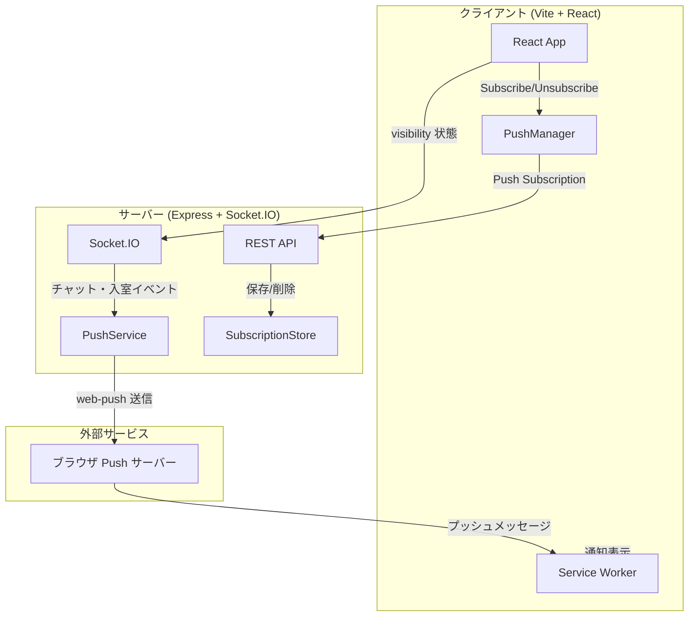

# 技術設計ドキュメント: PWA プッシュ通知

## 概要

本設計は、既存の Vite + React + TypeScript クライアントと Express + Socket.IO サーバーで構成されるビデオ会議アプリケーションに、PWA（Progressive Web App）機能とWeb Push通知を追加するものである。

主な変更点:
- **クライアント側**: `vite-plugin-pwa` による Service Worker 自動生成、Web App Manifest 設定、Push Subscription 管理、フォアグラウンド/バックグラウンド状態検出
- **サーバー側**: `web-push` ライブラリによるプッシュ通知送信、Subscription の永続化（JSON ファイル）、既存 Socket.IO イベントへの通知トリガー統合

既存のアーキテクチャ（Google OAuth 認証、JWT トークン、Socket.IO シグナリング、JSON ファイルベースのデータストア）を最大限活用し、最小限の変更で機能を実現する。

## アーキテクチャ

### 全体構成



### データフロー

1. **購読フロー**: React App → PushManager.subscribe() → POST /api/push/subscribe → SubscriptionStore (JSON)
2. **通知送信フロー**: Socket.IO イベント発火 → PushService → web-push → ブラウザ Push サーバー → Service Worker → Notification API
3. **状態管理フロー**: Page Visibility API → Socket.IO emit('visibility-state') → サーバー側 Map で管理

## コンポーネントとインターフェース

### クライアント側コンポーネント

#### 1. Vite PWA 設定 (`client/vite.config.ts`)

`vite-plugin-pwa` を追加し、Service Worker の自動生成と Web App Manifest を設定する。

```typescript
import { VitePWA } from 'vite-plugin-pwa';

// plugins 配列に追加
VitePWA({
  registerType: 'prompt', // ユーザーに更新を促す
  workbox: {
    globPatterns: ['**/*.{js,css,html,ico,png,svg}'],
  },
  manifest: {
    name: 'ビデオ会議アプリ',
    short_name: 'VC App',
    start_url: '/web_rtc/',
    scope: '/web_rtc/',
    display: 'standalone',
    theme_color: '#1a1a2e',
    background_color: '#1a1a2e',
    icons: [
      { src: '/web_rtc/icons/icon-192x192.png', sizes: '192x192', type: 'image/png' },
      { src: '/web_rtc/icons/icon-512x512.png', sizes: '512x512', type: 'image/png' },
    ],
  },
})
```

#### 2. Service Worker カスタムロジック (`client/public/sw-custom.js`)

`vite-plugin-pwa` が生成する Service Worker に加え、push イベントと notificationclick イベントを処理するカスタムスクリプトを `injectManifest` モードで統合する。

```typescript
// push イベント: プッシュ通知の受信と表示
self.addEventListener('push', (event) => {
  const data = event.data?.json();
  // data: { type, title, body, roomId, tag? }
  event.waitUntil(
    self.registration.showNotification(data.title, {
      body: data.body,
      icon: '/web_rtc/icons/icon-192x192.png',
      tag: data.tag || data.roomId, // 同一タグで通知をグループ化
      data: { roomId: data.roomId, type: data.type },
    })
  );
});

// notificationclick イベント: 通知タップ時のナビゲーション
self.addEventListener('notificationclick', (event) => {
  event.notification.close();
  const { roomId } = event.notification.data;
  const url = `/web_rtc/room/${roomId}`;
  event.waitUntil(
    clients.matchAll({ type: 'window' }).then((windowClients) => {
      // 既に開いているタブがあればフォーカス
      for (const client of windowClients) {
        if (client.url.includes(url) && 'focus' in client) {
          return client.focus();
        }
      }
      // なければ新しいタブで開く
      return clients.openWindow(url);
    })
  );
});
```

#### 3. Push 通知フック (`client/src/hooks/usePushNotification.ts`)

Push Subscription の管理を担当する React Hook。

```typescript
interface UsePushNotificationReturn {
  isSupported: boolean;           // Push API サポート有無
  permission: NotificationPermission; // 'default' | 'granted' | 'denied'
  isSubscribed: boolean;          // 購読中かどうか
  subscribe: () => Promise<void>; // 購読開始
  unsubscribe: () => Promise<void>; // 購読解除
}
```

#### 4. 通知許可 UI コンポーネント (`client/src/components/NotificationPrompt.tsx`)

Dashboard に表示する通知許可プロンプト。通知許可が `default` 状態の時のみ表示。

#### 5. 招待送信 UI (`client/src/components/InviteDialog.tsx`)

Dashboard のルームカードから「URL 共有」ボタン押下時に表示するダイアログ。登録ユーザー一覧から送信先を選択し、プッシュ通知付き招待を送信する。

#### 6. Visibility 状態管理 (`client/src/hooks/useVisibilityState.ts`)

Page Visibility API を使用し、Socket.IO 経由でサーバーに状態を通知する Hook。

```typescript
// document.visibilityState の変化を監視
// 'hidden' → socket.emit('visibility-state', { state: 'background', roomId })
// 'visible' → socket.emit('visibility-state', { state: 'foreground', roomId })
```

### サーバー側コンポーネント

#### 1. Push 通知サービス (`server/src/pushService.ts`)

`web-push` ライブラリを使用したプッシュ通知送信の中核モジュール。

```typescript
interface PushService {
  sendNotification(userSub: string, payload: PushPayload): Promise<void>;
  sendToRoom(roomId: string, payload: PushPayload, excludeUserSub?: string): Promise<void>;
}

interface PushPayload {
  type: 'invite' | 'chat' | 'join';
  title: string;
  body: string;
  roomId: string;
  tag?: string;
}
```

#### 2. Subscription ストア (`server/src/subscriptionStore.ts`)

Push Subscription データの永続化。既存の `userStore.ts` / `roomStore.ts` と同じパターンで JSON ファイルに保存。

```typescript
interface SubscriptionRecord {
  userSub: string;          // ユーザー ID (Google sub)
  deviceId: string;         // デバイス識別子 (endpoint のハッシュ)
  subscription: PushSubscription; // ブラウザの PushSubscription オブジェクト
  createdAt: string;        // ISO 8601
}

interface SubscriptionStore {
  save(record: SubscriptionRecord): void;
  findByUser(userSub: string): SubscriptionRecord[];
  remove(userSub: string, deviceId: string): boolean;
  removeByUser(userSub: string): void;
  removeByEndpoint(endpoint: string): void;
}
```

#### 3. Push API ルート (`server/src/routes/push.ts`)

```typescript
// POST /api/push/subscribe    - Subscription 登録
// DELETE /api/push/subscribe   - Subscription 削除
// POST /api/push/invite        - ルーム招待通知送信
// GET /api/push/vapid-public-key - VAPID 公開鍵取得
```

#### 4. Visibility 状態管理（`server/src/index.ts` 内 Socket.IO 拡張）

既存の Socket.IO ハンドラに `visibility-state` イベントを追加。

```typescript
// ユーザーの visibility 状態を管理する Map
// key: `${userSub}:${roomId}`, value: 'foreground' | 'background'
const userVisibility: Map<string, 'foreground' | 'background'> = new Map();
```

## データモデル

### Push Subscription データ (`server/data/subscriptions.json`)

```json
[
  {
    "userSub": "google-user-id-123",
    "deviceId": "sha256-of-endpoint",
    "subscription": {
      "endpoint": "https://fcm.googleapis.com/fcm/send/...",
      "keys": {
        "p256dh": "base64-encoded-key",
        "auth": "base64-encoded-auth"
      }
    },
    "createdAt": "2025-01-01T00:00:00.000Z"
  }
]
```

### Push 通知ペイロード

```typescript
// Service Worker が受信する JSON ペイロード
interface PushNotificationPayload {
  type: 'invite' | 'chat' | 'join';
  title: string;
  body: string;
  roomId: string;
  tag?: string; // 通知グループ化用
}
```

### 環境変数の追加

```
# server/.env
VAPID_PUBLIC_KEY=<base64-encoded-public-key>
VAPID_PRIVATE_KEY=<base64-encoded-private-key>
VAPID_SUBJECT=mailto:admin@example.com

# client/.env
VITE_VAPID_PUBLIC_KEY=<base64-encoded-public-key>
```

### API エンドポイント設計

| メソッド | パス | 認証 | 説明 |
|---------|------|------|------|
| GET | `/api/push/vapid-public-key` | 不要 | VAPID 公開鍵を返す |
| POST | `/api/push/subscribe` | 必要 | Push Subscription を登録 |
| DELETE | `/api/push/subscribe` | 必要 | Push Subscription を削除 |
| POST | `/api/push/invite` | 必要 | ルーム招待通知を送信 |

#### POST /api/push/subscribe

リクエスト:
```json
{
  "subscription": {
    "endpoint": "https://...",
    "keys": { "p256dh": "...", "auth": "..." }
  }
}
```

レスポンス: `201 Created`

#### DELETE /api/push/subscribe

リクエスト:
```json
{
  "endpoint": "https://..."
}
```

レスポンス: `204 No Content`

#### POST /api/push/invite

リクエスト:
```json
{
  "roomId": "uuid",
  "targetUserSubs": ["google-sub-1", "google-sub-2"]
}
```

レスポンス: `200 OK` with `{ "sent": 2, "failed": 0 }`

### Socket.IO イベント追加

| イベント名 | 方向 | ペイロード | 説明 |
|-----------|------|-----------|------|
| `visibility-state` | Client → Server | `{ state: 'foreground' \| 'background', roomId: string }` | ユーザーの表示状態を通知 |


## 正確性プロパティ (Correctness Properties)

*プロパティとは、システムのすべての有効な実行において真であるべき特性や振る舞いのことである。プロパティは、人間が読める仕様と機械的に検証可能な正確性保証の橋渡しとなる。*

### Property 1: Manifest 必須フィールド検証

*任意の* Web App Manifest オブジェクトに対して、`name`、`icons`（192x192 と 512x512 の両サイズ）、`theme_color`、`display: 'standalone'`、`start_url`、`scope` フィールドが存在し、icons 配列には少なくとも 192x192 と 512x512 のサイズが含まれること。

**Validates: Requirements 1.1**

### Property 2: Push イベントから通知表示への変換

*任意の* 有効な Push ペイロード（type, title, body, roomId を含む JSON）に対して、Service Worker の push イベントハンドラは `showNotification` を呼び出し、ペイロードの `title` をタイトルに、`body` を本文に、`roomId` を通知データに含めること。

**Validates: Requirements 2.4**

### Property 3: 通知クリック時の正しい URL ナビゲーション

*任意の* roomId を含む通知データに対して、notificationclick イベントハンドラが開く URL は `/web_rtc/room/${roomId}` と一致すること。

**Validates: Requirements 2.5, 5.4, 6.3, 7.3**

### Property 4: Subscription 永続化ラウンドトリップ

*任意の* 有効な SubscriptionRecord（userSub, deviceId, subscription, createdAt）に対して、SubscriptionStore に保存した後に同じ userSub で検索すると、保存したデータと同一の subscription オブジェクトが取得できること。

**Validates: Requirements 3.4, 9.1**

### Property 5: 購読解除による Subscription 削除

*任意の* 保存済み SubscriptionRecord に対して、該当の userSub と deviceId で削除を実行した後、同じ userSub と deviceId で検索すると結果が空であること。

**Validates: Requirements 3.5**

### Property 6: ログアウト時の全 Subscription 削除

*任意の* ユーザー（userSub）が N 個（N ≥ 1）のデバイスで Subscription を登録している場合、removeByUser(userSub) を実行した後、findByUser(userSub) の結果は空配列であること。

**Validates: Requirements 3.7**

### Property 7: 全登録デバイスへの通知配信

*任意の* ユーザー（userSub）が N 個（N ≥ 1）のデバイスで Subscription を登録している場合、そのユーザーへの通知送信は N 回の web-push 送信を試行すること。

**Validates: Requirements 5.2, 9.3**

### Property 8: 通知ペイロードの必須フィールド

*任意の* 通知タイプ（invite, chat, join）とその入力データに対して、生成されるペイロードは以下を満たすこと:
- invite: title にルーム名と招待者名を含む
- chat: body に送信者名を含み、メッセージは先頭 100 文字以内に切り詰められる
- join: title または body に入室ユーザー名とルーム名を含む

**Validates: Requirements 5.3, 6.2, 7.2**

### Property 9: バックグラウンド参加者のみへの通知送信

*任意の* ルームイベント（チャットメッセージまたはユーザー入室）に対して、プッシュ通知はバックグラウンド状態の参加者にのみ送信され、フォアグラウンド状態の参加者には送信されないこと。また、イベント発生者自身には送信されないこと。

**Validates: Requirements 6.1, 6.4, 7.1, 7.4**

### Property 10: 通知タグによるグループ化

*任意の* 同一 roomId を持つチャット通知に対して、生成されるペイロードの `tag` フィールドは同一の値（`chat-${roomId}`）を持ち、ブラウザの通知置換メカニズムにより同一タグの通知は 1 つにまとめられること。

**Validates: Requirements 6.5**

### Property 11: Visibility 状態のラウンドトリップ

*任意の* ユーザーとルームの組み合わせに対して、visibility 状態を 'background' に設定した後に取得すると 'background' が返り、'foreground' に設定した後に取得すると 'foreground' が返ること。

**Validates: Requirements 8.2, 8.3, 8.4**

### Property 12: マルチデバイス Subscription 管理

*任意の* ユーザー（userSub）が異なる deviceId で N 個の Subscription を登録した場合、findByUser(userSub) は正確に N 個のレコードを返し、各レコードの deviceId は一意であること。

**Validates: Requirements 9.2**

## エラーハンドリング

### クライアント側

| エラー状況 | 対応 |
|-----------|------|
| Service Worker 登録失敗 | コンソールにエラーログ。通知機能なしで通常動作を継続（要件 2.3） |
| Push API 非サポートブラウザ | 通知関連 UI を非表示（要件 3.6） |
| 通知許可が拒否（denied） | 通知有効化ボタンを無効化し、ブラウザ設定での変更を案内 |
| Subscription API 呼び出し失敗 | ユーザーにエラーメッセージを表示し、再試行を促す |
| VAPID 公開鍵が未設定 | 通知機能を無効化し、コンソールに警告 |

### サーバー側

| エラー状況 | 対応 |
|-----------|------|
| VAPID 鍵が環境変数に未設定 | プッシュ通知機能を無効化、警告ログ出力（要件 4.3） |
| web-push 送信で 410 Gone | 該当 Subscription を自動削除（要件 5.5） |
| web-push 送信で 429 Too Many Requests | 指数バックオフでリトライ（最大 3 回） |
| Subscription JSON ファイル書き込み失敗 | エラーログ記録、500 レスポンス返却（要件 9.4） |
| 無効な Subscription データ受信 | 400 Bad Request を返却 |

## テスト戦略

### テストアプローチ

本機能では、ユニットテストとプロパティベーステストの二重アプローチを採用する。

- **ユニットテスト**: 具体的な例、エッジケース、エラー条件の検証
- **プロパティベーステスト**: ランダム生成された入力による普遍的プロパティの検証

### プロパティベーステスト

**ライブラリ**: `fast-check`（クライアント・サーバー両方で既に devDependencies に含まれている）

**設定**:
- 各プロパティテストは最低 100 回のイテレーションを実行
- 各テストは設計ドキュメントのプロパティを参照するコメントを含む
- タグ形式: **Feature: pwa-push-notifications, Property {number}: {property_text}**
- 各正確性プロパティは 1 つのプロパティベーステストで実装する

**テスト対象コンポーネント**:

| プロパティ | テスト対象 | テストファイル |
|-----------|-----------|--------------|
| P1: Manifest 検証 | Manifest 設定オブジェクト | `client/src/__tests__/manifest.test.ts` |
| P2: Push → 通知表示 | SW push ハンドラロジック | `client/src/__tests__/pushHandler.test.ts` |
| P3: 通知クリック → URL | SW notificationclick ロジック | `client/src/__tests__/pushHandler.test.ts` |
| P4: Subscription ラウンドトリップ | SubscriptionStore | `server/src/__tests__/subscriptionStore.test.ts` |
| P5: 購読解除 | SubscriptionStore | `server/src/__tests__/subscriptionStore.test.ts` |
| P6: ログアウト全削除 | SubscriptionStore | `server/src/__tests__/subscriptionStore.test.ts` |
| P7: 全デバイス配信 | PushService | `server/src/__tests__/pushService.test.ts` |
| P8: ペイロード必須フィールド | PushService ペイロード生成 | `server/src/__tests__/pushService.test.ts` |
| P9: バックグラウンドのみ通知 | PushService フィルタリング | `server/src/__tests__/pushService.test.ts` |
| P10: タグによるグループ化 | PushService ペイロード生成 | `server/src/__tests__/pushService.test.ts` |
| P11: Visibility 状態ラウンドトリップ | Visibility 状態管理 | `server/src/__tests__/visibilityState.test.ts` |
| P12: マルチデバイス管理 | SubscriptionStore | `server/src/__tests__/subscriptionStore.test.ts` |

### ユニットテスト

ユニットテストは以下に焦点を当てる:

- **エッジケース**: SW 登録失敗時の graceful degradation、Push API 非サポート時の UI 非表示、無効な Subscription の自動削除（410 Gone）、VAPID 鍵未設定時の無効化
- **統合ポイント**: Socket.IO visibility-state イベントの送受信、REST API エンドポイントのリクエスト/レスポンス検証
- **具体例**: 特定の通知ペイロードの表示確認、特定のルーム URL へのナビゲーション確認
