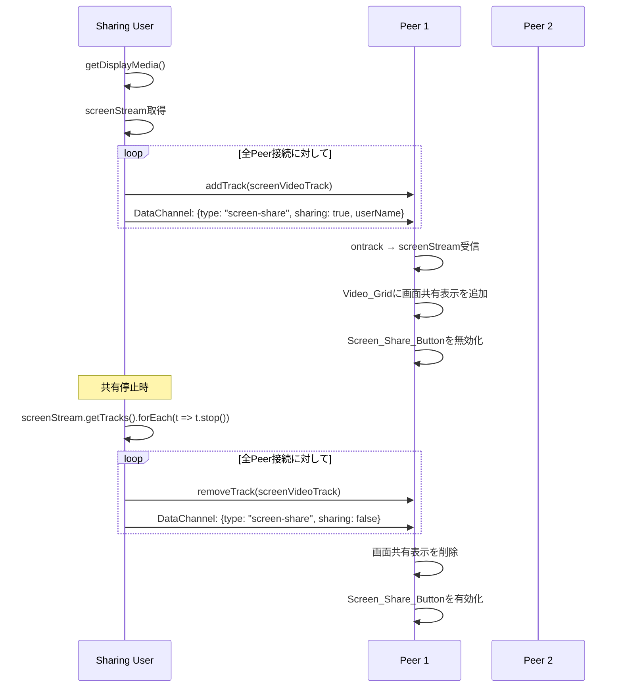

# 技術設計書: 画面共有機能

## Overview

本設計は、WebRTC Meetアプリケーションに画面共有機能を追加するものである。既存のsimple-peer + Socket.IO + DataChannelアーキテクチャを活用し、`getDisplayMedia()` APIで取得した画面共有ストリームをP2P接続経由で他の参加者に配信する。

画面共有は既存のカメラ/マイクストリームとは独立した追加ストリームとして扱い、同時に1人のみが画面共有可能な排他制御を実装する。状態通知はDataChannelを使用し、サーバー側の変更は不要とする。

### 設計方針

- **サーバー変更なし**: 画面共有の状態管理はDataChannel経由でP2P通信。サーバーはシグナリングのみ
- **追加ストリーム方式**: 画面共有はカメラストリームとは別のストリームとして`addTrack()`/`removeTrack()`で管理
- **排他制御はクライアント側**: DataChannelメッセージで画面共有状態を全参加者に通知し、UIで排他制御

## Architecture



### コンポーネント構成

```
Room.tsx (既存・拡張)
├── 画面共有状態管理 (screenStream, isScreenSharing, screenSharingUserId)
├── startScreenShare() / stopScreenShare()
├── DataChannel メッセージハンドラ拡張
├── VideoPlayer (既存)
├── ScreenShareView (新規) - 画面共有映像の表示
└── Controls_Bar 拡張
    └── ScreenShareButton (新規)
```

## Components and Interfaces

### 1. Room.tsx の拡張

#### 新規State

```typescript
// 画面共有関連のState
const [screenStream, setScreenStream] = useState<MediaStream | null>(null);
const [isScreenSharing, setIsScreenSharing] = useState(false);

// 誰が画面共有中か（自分含む全参加者で共有）
const [screenSharingUserId, setScreenSharingUserId] = useState<string | null>(null);
const [screenSharingUserName, setScreenSharingUserName] = useState<string | null>(null);

// Ref
const screenStreamRef = useRef<MediaStream | null>(null);
```

#### PeerData インターフェース拡張

```typescript
interface PeerData {
  peerId: string;
  peer: Peer.Instance;
  stream?: MediaStream;
  screenStream?: MediaStream;       // 新規: 画面共有ストリーム
  isAudioEnabled?: boolean;
  isVideoEnabled?: boolean;
  userName?: string;
}
```

#### DataChannel メッセージ型

```typescript
// 既存のstatusメッセージに加え、screen-shareメッセージを追加
type DataChannelMessage =
  | { type: 'status'; audio: boolean; video: boolean }
  | { type: 'screen-share'; sharing: boolean; userName?: string };
```

### 2. startScreenShare() 関数

```typescript
const startScreenShare = async () => {
  try {
    const screenStream = await navigator.mediaDevices.getDisplayMedia({
      video: { cursor: 'always' },
      audio: false
    });

    const screenTrack = screenStream.getVideoTracks()[0];

    // ブラウザの「共有を停止」ボタン対応
    screenTrack.onended = () => {
      stopScreenShare();
    };

    // 全Peerに画面共有トラックを追加
    Object.values(peersRef.current).forEach(peer => {
      if (!peer.destroyed) {
        peer.addTrack(screenTrack, screenStream);
      }
    });

    // DataChannelで画面共有開始を通知
    broadcastScreenShareStatus(true, userName);

    setScreenStream(screenStream);
    screenStreamRef.current = screenStream;
    setIsScreenSharing(true);
    setScreenSharingUserId(socketRef.current?.id || null);
    setScreenSharingUserName(userName);
  } catch (err: any) {
    // ユーザーがキャンセルした場合はエラーを表示しない
    if (err.name === 'NotAllowedError' || err.name === 'AbortError') {
      return;
    }
    console.error('Failed to start screen sharing:', err);
    alert('画面共有の開始に失敗しました');
  }
};
```

### 3. stopScreenShare() 関数

```typescript
const stopScreenShare = () => {
  if (screenStreamRef.current) {
    // 全トラックを停止
    screenStreamRef.current.getTracks().forEach(track => track.stop());

    // 全Peerから画面共有トラックを削除
    const screenTrack = screenStreamRef.current.getVideoTracks()[0];
    if (screenTrack) {
      Object.values(peersRef.current).forEach(peer => {
        if (!peer.destroyed) {
          peer.removeTrack(screenTrack, screenStreamRef.current!);
        }
      });
    }

    // DataChannelで画面共有停止を通知
    broadcastScreenShareStatus(false);

    setScreenStream(null);
    screenStreamRef.current = null;
    setIsScreenSharing(false);
    setScreenSharingUserId(null);
    setScreenSharingUserName(null);
  }
};
```

### 4. broadcastScreenShareStatus() 関数

```typescript
const broadcastScreenShareStatus = (sharing: boolean, sharingUserName?: string) => {
  const message = JSON.stringify({
    type: 'screen-share',
    sharing,
    userName: sharingUserName
  });

  Object.values(peersRef.current).forEach(peer => {
    if (peer && !peer.destroyed) {
      try {
        peer.send(message);
      } catch (err) {
        console.warn('[DataChannel] Screen share status send error:', err);
      }
    }
  });
};
```

### 5. DataChannel メッセージハンドラの拡張

既存の `peer.on('data', ...)` ハンドラに `screen-share` タイプの処理を追加:

```typescript
peer.on('data', data => {
  try {
    const message = JSON.parse(data.toString());
    
    if (message.type === 'status') {
      updatePeerTrackState(peerId, 'audio', message.audio);
      updatePeerTrackState(peerId, 'video', message.video);
    } else if (message.type === 'screen-share') {
      if (message.sharing) {
        setScreenSharingUserId(peerId);
        setScreenSharingUserName(message.userName || null);
      } else {
        setScreenSharingUserId(null);
        setScreenSharingUserName(null);
        // Peerの画面共有ストリームをクリア
        setPeers(prev => prev.map(p =>
          p.peerId === peerId ? { ...p, screenStream: undefined } : p
        ));
      }
    }
  } catch (err) {
    console.warn('[DataChannel] Parse error:', err);
  }
});
```

### 6. ストリーム受信の拡張

simple-peerの `stream` イベントは、新しいストリームが追加されるたびに発火する。2つ目のストリーム（画面共有）を区別するロジック:

```typescript
peer.on('stream', (remoteStream: MediaStream) => {
  const videoTracks = remoteStream.getVideoTracks();
  const audioTracks = remoteStream.getAudioTracks();

  // 画面共有ストリームの判定:
  // - 音声トラックがない
  // - screenSharingUserIdがこのPeerと一致
  if (audioTracks.length === 0 && videoTracks.length > 0 && screenSharingUserId === peerId) {
    // 画面共有ストリームとして保存
    setPeers(prev => prev.map(p =>
      p.peerId === peerId ? { ...p, screenStream: remoteStream } : p
    ));
  } else {
    // 通常のカメラ/マイクストリーム
    updatePeerStream(peerId, remoteStream);
  }
});
```

### 7. ScreenShareView コンポーネント（新規）

```typescript
interface ScreenShareViewProps {
  stream: MediaStream;
  userName: string;
}

const ScreenShareView: React.FC<ScreenShareViewProps> = ({ stream, userName }) => {
  const videoRef = useRef<HTMLVideoElement>(null);

  useEffect(() => {
    if (videoRef.current && stream) {
      videoRef.current.srcObject = stream;
    }
  }, [stream]);

  return (
    <div className="screen-share-wrapper">
      <video ref={videoRef} autoPlay playsInline />
      <div className="screen-share-label">
        {userName} の画面共有
      </div>
    </div>
  );
};
```

### 8. ScreenShareButton コンポーネント

Controls_Bar内に配置。カメラボタンとスピーカーボタンの間に挿入:

```typescript
interface ScreenShareButtonProps {
  isScreenSharing: boolean;
  isDisabled: boolean;
  disabledReason?: string;
  onToggle: () => void;
  isSupported: boolean;
}
```

ボタンの状態:
- `isSupported === false`: 非表示（`getDisplayMedia`非対応ブラウザ）
- `isDisabled === true`: 無効化状態 + ツールチップ「他の参加者が画面共有中です」
- `isScreenSharing === true`: アクティブ状態 + ツールチップ「共有を停止」
- デフォルト: 通常状態 + ツールチップ「画面を共有」

### 9. Video_Grid レイアウト拡張

画面共有中のレイアウト:

```
┌─────────────────────────────────────────┐
│                                         │
│          画面共有映像（大）              │
│          ScreenShareView                │
│                                         │
├──────────┬──────────┬──────────┬────────┤
│ User A   │ User B   │ User C   │ ...    │
│ (camera) │ (camera) │ (camera) │        │
└──────────┴──────────┴──────────┴────────┘
```

画面共有がない場合は既存のグリッドレイアウトを維持。

### 10. 退出時のクリーンアップ

`user-disconnected` イベントハンドラを拡張:

```typescript
socketRef.current.on('user-disconnected', (userId: string) => {
  // 画面共有中のユーザーが退出した場合のクリーンアップ
  if (screenSharingUserId === userId) {
    setScreenSharingUserId(null);
    setScreenSharingUserName(null);
  }

  if (peersRef.current[userId]) {
    peersRef.current[userId].destroy();
    delete peersRef.current[userId];
    setPeers(prev => prev.filter(p => p.peerId !== userId));
  }
});
```

### 11. getDisplayMedia サポート検出

```typescript
const isScreenShareSupported = typeof navigator.mediaDevices?.getDisplayMedia === 'function';
```

## Data Models

### DataChannel メッセージスキーマ

| フィールド | 型 | 説明 |
|---|---|---|
| `type` | `'status' \| 'screen-share'` | メッセージ種別 |
| `audio` | `boolean` (statusのみ) | マイク状態 |
| `video` | `boolean` (statusのみ) | カメラ状態 |
| `sharing` | `boolean` (screen-shareのみ) | 画面共有状態 |
| `userName` | `string?` (screen-shareのみ) | 共有者の名前 |

### Room State 拡張

| State | 型 | 初期値 | 説明 |
|---|---|---|---|
| `screenStream` | `MediaStream \| null` | `null` | ローカルの画面共有ストリーム |
| `isScreenSharing` | `boolean` | `false` | 自分が画面共有中か |
| `screenSharingUserId` | `string \| null` | `null` | 画面共有中のユーザーのSocket ID |
| `screenSharingUserName` | `string \| null` | `null` | 画面共有中のユーザー名 |

### PeerData 拡張

| フィールド | 型 | 説明 |
|---|---|---|
| `screenStream` | `MediaStream?` | リモートの画面共有ストリーム |


## Correctness Properties

*A property is a characteristic or behavior that should hold true across all valid executions of a system—essentially, a formal statement about what the system should do. Properties serve as the bridge between human-readable specifications and machine-verifiable correctness guarantees.*

### Property 1: 画面共有トラックのラウンドトリップ

*For any* set of peer connections and a valid screen share stream, starting screen sharing should add the screen video track to every peer connection, and stopping screen sharing should remove the screen video track from every peer connection, leaving each peer in its original state (camera/audio tracks unchanged).

**Validates: Requirements 1.2, 2.1**

### Property 2: DataChannel 画面共有通知のブロードキャスト

*For any* set of connected peers, when screen sharing starts, every peer should receive a DataChannel message `{type: "screen-share", sharing: true, userName: <name>}`, and when screen sharing stops, every peer should receive `{type: "screen-share", sharing: false}`.

**Validates: Requirements 1.3, 2.3**

### Property 3: 画面共有ラベルにユーザー名を表示

*For any* user name string, the ScreenShareView component should render that user name and a "画面共有" label in the display.

**Validates: Requirements 3.3**

### Property 4: 画面共有中のカメラ・マイクストリーム維持

*For any* screen sharing session, the local camera video track and audio track should remain present and enabled in all peer connections throughout the duration of the screen share.

**Validates: Requirements 4.1, 4.2**

### Property 5: 画面共有ボタンの排他制御

*For any* room state, the Screen_Share_Button should be disabled if and only if `screenSharingUserId` is set and is not the local user's ID. When `screenSharingUserId` becomes null (by stop or disconnect), the button should be enabled.

**Validates: Requirements 5.1, 5.3, 6.2**

### Property 6: getDisplayMedia 非対応時のボタン非表示

*For any* browser environment where `navigator.mediaDevices.getDisplayMedia` is not a function, the Screen_Share_Button should not be rendered in the DOM.

**Validates: Requirements 7.2**

### Property 7: ツールチップの状態反映

*For any* boolean `isScreenSharing` state, the Screen_Share_Button's tooltip should be "共有を停止" when `isScreenSharing` is true, and "画面を共有" when `isScreenSharing` is false.

**Validates: Requirements 8.4**

## Error Handling

### エラーケース一覧

| エラー | 原因 | 対処 |
|---|---|---|
| `NotAllowedError` / `AbortError` | ユーザーが画面選択ダイアログをキャンセル | 何もしない。状態を変更しない |
| `getDisplayMedia` 未定義 | ブラウザ非対応 | Screen_Share_Button を非表示 |
| その他の `getDisplayMedia` エラー | 権限拒否、セキュリティポリシー等 | 「画面共有の開始に失敗しました」メッセージ表示 |
| `addTrack` 失敗 | Peer接続の問題 | screenStreamを停止し、エラーメッセージ表示 |
| `track.onended` 発火 | ブラウザの「共有を停止」ボタン | `stopScreenShare()` を自動実行 |
| 画面共有中のユーザー退出 | ネットワーク切断/退出 | `user-disconnected` ハンドラでクリーンアップ |

### エラーハンドリング方針

- キャンセル系エラー（`NotAllowedError`, `AbortError`）は無視し、状態を維持
- 致命的エラーは `alert()` でユーザーに通知（既存パターンに合わせる）
- クリーンアップは必ず実行し、中途半端な状態を残さない
- `try-catch` で `addTrack`/`removeTrack` を囲み、個別のPeer失敗が全体に影響しないようにする

## Testing Strategy

### テストフレームワーク

- **ユニットテスト**: Vitest + React Testing Library
- **プロパティベーステスト**: fast-check (Vitest上で実行)

### ユニットテスト

具体的な例やエッジケースの検証に使用:

- `startScreenShare()` が `getDisplayMedia()` を呼び出すこと (1.1)
- ブラウザの「共有を停止」で `track.onended` が `stopScreenShare()` をトリガーすること (2.2)
- 画面共有開始通知受信時に ScreenShareView が表示されること (3.1)
- 画面共有停止通知受信時に ScreenShareView が削除されること (3.4)
- 画面共有中もマイク/カメラトグルが機能すること (4.3)
- 他ユーザーの画面共有開始通知でボタンが無効化+ツールチップ表示 (5.2)
- 画面共有中ユーザーの退出で表示がクリーンアップされること (6.1, 6.3)
- キャンセル時にエラーが表示されないこと (7.1)
- エラー時にメッセージが表示されること (7.3, 7.4)
- ボタンがカメラとスピーカーの間に配置されること (8.1)
- 正しいアイコンが使用されること (8.2)
- アクティブ状態のスタイルが適用されること (8.3)

### プロパティベーステスト

各テストは最低100回のイテレーションで実行。各テストにはデザインドキュメントのプロパティ番号をタグ付け:

- **Feature: screen-sharing, Property 1**: 画面共有トラックのラウンドトリップ
- **Feature: screen-sharing, Property 2**: DataChannel通知のブロードキャスト
- **Feature: screen-sharing, Property 3**: 画面共有ラベルにユーザー名を表示
- **Feature: screen-sharing, Property 4**: 画面共有中のカメラ・マイクストリーム維持
- **Feature: screen-sharing, Property 5**: 画面共有ボタンの排他制御
- **Feature: screen-sharing, Property 6**: getDisplayMedia非対応時のボタン非表示
- **Feature: screen-sharing, Property 7**: ツールチップの状態反映

### テスト環境の注意点

- `getDisplayMedia()` はテスト環境ではモックが必要
- simple-peerの `addTrack`/`removeTrack` もモック対象
- DataChannelの `send()` はスパイで検証
- fast-checkのArbitrary生成器でランダムなユーザー名、Peer数、状態遷移を生成
