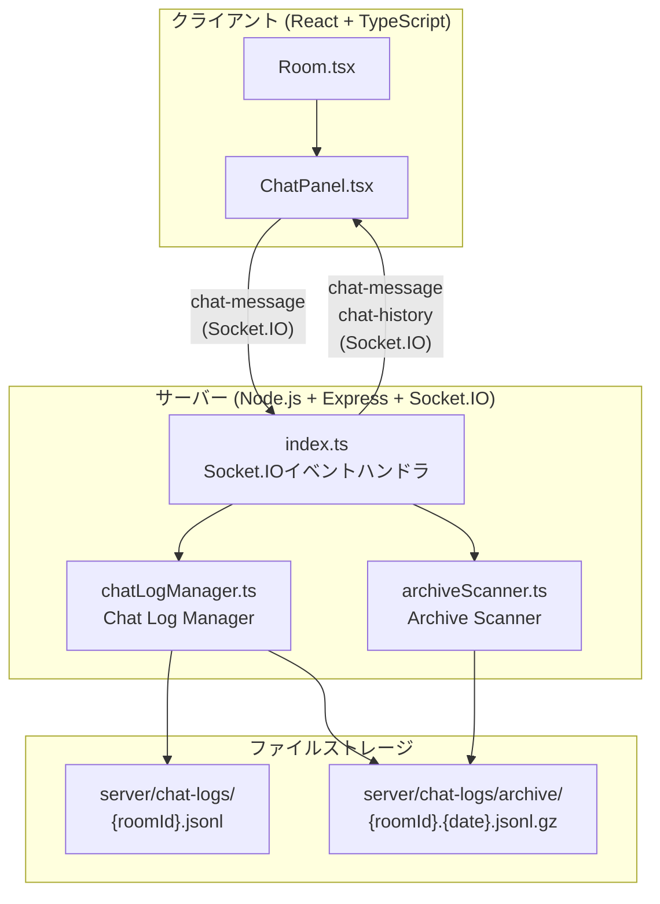
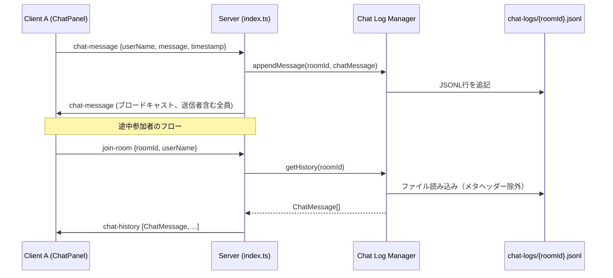
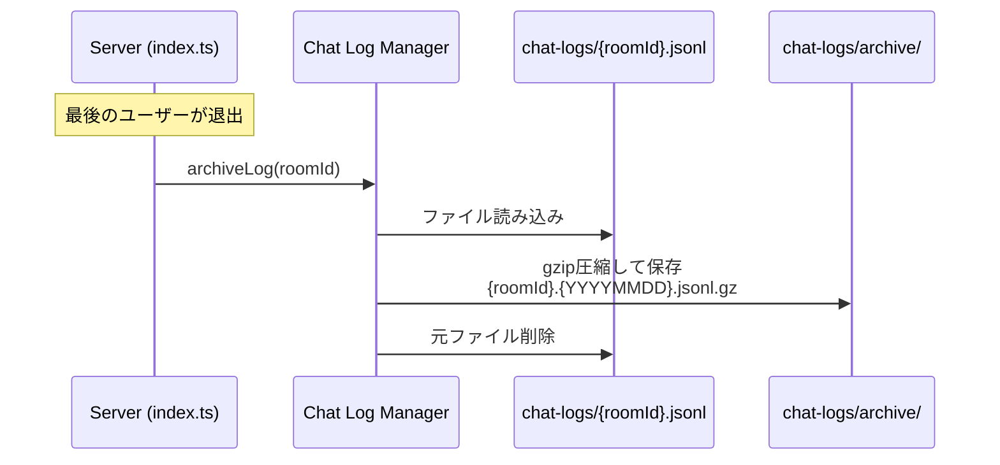

# テキストチャット機能 設計書

## 概要

既存のWebRTCビデオ通話アプリケーションにテキストチャット機能を追加する。メッセージの中継にはSocket.IOサーバーリレー方式を採用し、既存のSocket.IO接続を再利用する。チャットログはサーバー側でJSONLファイルに永続化し、全ユーザー退出時にgzip圧縮してアーカイブする。30日経過したアーカイブはサーバー起動時および1時間ごとの定期スキャンで自動削除する。

### 設計判断の根拠

| 判断項目 | 選択 | 理由 |
|---------|------|------|
| メッセージ中継方式 | Socket.IOサーバーリレー | サーバー側でログ永続化が必要。DataChannelではサーバーにメッセージが到達しない |
| ストレージ形式 | JSONL + メタヘッダー | 追記のみの書き込みで高パフォーマンス。行単位のパースで部分的な破損に強い |
| アーカイブトリガー | 全ユーザー退出時 | `roomUsers[roomId]?.length === 0`の既存検出ロジックを活用。タイマー不要でシンプル |
| アーカイブ保持期間 | 30日 + 定期クリーンアップ | 起動時 + 1時間ごとのスキャンで確実に期限切れファイルを削除 |
| クライアントUI | サイドパネル（トグル式） | ビデオグリッドを妨げず、モバイルでも利用可能 |

## アーキテクチャ

### システム構成図



### メッセージフロー



### アーカイブフロー



## コンポーネントとインターフェース

### 1. ChatPanel.tsx（クライアント）

新規コンポーネント: `client/src/components/ChatPanel.tsx`

```typescript
interface ChatPanelProps {
  socket: Socket | null;
  userName: string;
  isOpen: boolean;
  onUnreadCountChange: (count: number) => void;
}

interface ChatMessage {
  userName: string;
  message: string;
  timestamp: number;
}
```

**責務:**
- メッセージ入力フォームの管理（空白バリデーション含む）
- `chat-message`イベントの送信
- `chat-message`/`chat-history`イベントの受信とメッセージ一覧の表示
- 自動スクロール
- 未読メッセージカウントの管理（パネル非表示時）
- 自分のメッセージと他者のメッセージの視覚的区別

### 2. Room.tsx の変更（クライアント）

既存コンポーネントへの追加:

```typescript
// 新規State
const [isChatOpen, setIsChatOpen] = useState(false);
const [unreadCount, setUnreadCount] = useState(0);
```

**変更内容:**
- チャットトグルボタンをコントロールバーに追加（`MessageSquare`アイコン、lucide-react）
- 未読バッジの表示
- `ChatPanel`コンポーネントの配置（ビデオグリッドの右側サイドパネル）
- `socketRef.current`をChatPanelに渡す

### 3. chatLogManager.ts（サーバー）

新規モジュール: `server/src/chatLogManager.ts`

```typescript
interface ChatMessage {
  userName: string;
  message: string;
  timestamp: number;
}

interface MetaHeader {
  _meta: 'header';
  roomId: string;
  createdAt: number;
}

// 公開API
function appendMessage(roomId: string, message: ChatMessage): void;
function getHistory(roomId: string): ChatMessage[];
function archiveLog(roomId: string): void;

// 内部ユーティリティ
function serializeMessage(message: ChatMessage): string;
function parseMessage(line: string): ChatMessage | null;
function ensureDirectories(): void;
```

**責務:**
- `server/chat-logs/`ディレクトリの管理
- JSONL形式でのメッセージ追記（`fs.appendFileSync`）
- メタヘッダーの書き込み（ファイル新規作成時）
- チャット履歴の読み込み（メタヘッダー除外）
- gzip圧縮とアーカイブ移動
- 不正なJSON行のスキップとエラーログ

### 4. archiveScanner.ts（サーバー）

新規モジュール: `server/src/archiveScanner.ts`

```typescript
function scanAndCleanup(): void;
function startScheduler(): void;
```

**責務:**
- `server/chat-logs/archive/`ディレクトリのスキャン
- ファイル名から日付を抽出し、30日超過のファイルを削除
- サーバー起動時の初回スキャン実行
- 1時間ごとの定期スキャン（`setInterval`）
- アクティブログファイル（`server/chat-logs/`直下）は操作対象外

### 5. index.ts の変更（サーバー）

既存ファイルへの追加:

```typescript
// 新規Socket.IOイベント
socket.on('chat-message', (payload: { message: string }) => {
  const userInfo = socketRoomMap[socket.id];
  if (!userInfo) return;
  
  const chatMessage: ChatMessage = {
    userName: userInfo.userName,
    message: payload.message,
    timestamp: Date.now()
  };
  
  // ログ永続化
  appendMessage(userInfo.roomId, chatMessage);
  
  // ルーム全体にブロードキャスト（送信者含む）
  io.to(userInfo.roomId).emit('chat-message', chatMessage);
});

// join-roomハンドラ内に追加
// チャット履歴の送信
const history = getHistory(roomId);
if (history.length > 0) {
  socket.emit('chat-history', history);
}

// disconnectハンドラ内に追加（roomUsers[roomId]?.length === 0 の分岐内）
// チャットログのアーカイブ
archiveLog(roomId);
```

## データモデル

### ChatMessage

```typescript
interface ChatMessage {
  userName: string;   // 送信者のユーザー名
  message: string;    // メッセージ本文
  timestamp: number;  // UNIXミリ秒タイムスタンプ
}
```

### MetaHeader

```typescript
interface MetaHeader {
  _meta: 'header';      // メタヘッダー識別子
  roomId: string;       // ルームID
  createdAt: number;    // ファイル作成時刻（UNIXミリ秒）
}
```

### JSONL ファイル構造

```
{"_meta":"header","roomId":"room-123","createdAt":1719900000000}
{"userName":"Alice","message":"こんにちは","timestamp":1719900001000}
{"userName":"Bob","message":"やあ","timestamp":1719900002000}
```

### アーカイブファイル命名規則

```
server/chat-logs/archive/{roomId}.{YYYYMMDD}.jsonl.gz
```

例: `server/chat-logs/archive/abc123.20250115.jsonl.gz`

### ディレクトリ構造

```
server/
├── chat-logs/
│   ├── abc.jsonl               # アクティブなチャットログ
│   ├── xyz.jsonl
│   └── archive/
│       ├── old1.20241215.jsonl.gz
│       └── old2.20241220.jsonl.gz
└── src/
    ├── index.ts                # 既存 + チャットイベント追加
    ├── chatLogManager.ts       # 新規
    └── archiveScanner.ts       # 新規
```


## 正当性プロパティ（Correctness Properties）

*プロパティとは、システムのすべての有効な実行において真であるべき特性や振る舞いのことである。人間が読める仕様と機械的に検証可能な正当性保証の橋渡しとなる形式的な記述である。*

### Property 1: ChatMessageシリアライズのラウンドトリップ

*任意の*有効なChatMessageオブジェクトに対して、`serializeMessage`で整形してから`parseMessage`でパースした結果は、元のオブジェクトと等価である。

**Validates: Requirements 8.3, 8.1, 8.2, 1.4**

### Property 2: 空白文字のみのメッセージは送信拒否される

*任意の*空白文字のみで構成された文字列（空文字、スペース、タブ、改行など）に対して、Chat_Panelはメッセージ送信を拒否し、`chat-message`イベントを発火しない。

**Validates: Requirements 1.2**

### Property 3: 送信後に入力フィールドがクリアされる

*任意の*有効な（非空白）メッセージを送信した後、Chat_Panelの入力フィールドの値は空文字列になる。

**Validates: Requirements 1.3**

### Property 4: メッセージはルーム内全ユーザーにブロードキャストされる

*任意の*ルームと*任意の*ルーム内ユーザーが送信したメッセージに対して、サーバーは送信者を含むルーム内の全ユーザーに`chat-message`イベントを配信する。

**Validates: Requirements 2.1**

### Property 5: メッセージ表示に必要な情報が含まれ、送信者が区別される

*任意の*ChatMessageとカレントユーザー名に対して、メッセージの表示にはユーザー名、本文、タイムスタンプが含まれ、かつカレントユーザー名と一致する場合は「自分のメッセージ」として異なるスタイルが適用される。

**Validates: Requirements 2.2, 2.4**

### Property 6: チャットパネルのトグル動作

*任意の*初期表示状態に対して、トグル操作を2回行うと元の表示状態に戻る（冪等性）。

**Validates: Requirements 3.2**

### Property 7: パネル非表示時の未読カウント

*任意の*パネルが非表示の状態で受信したN件のメッセージに対して、未読カウントはNと等しくなる。

**Validates: Requirements 3.3**

### Property 8: 初回メッセージでメタヘッダー付きファイルが作成される

*任意の*roomIdに対して、最初のメッセージを`appendMessage`で書き込んだ後、Chat_Log_Fileの先頭行は`_meta`フィールドを持つメタヘッダーであり、`roomId`フィールドが引数のroomIdと一致する。

**Validates: Requirements 4.1, 4.2**

### Property 9: 追記メッセージ数の不変条件

*任意の*N件のChatMessageを`appendMessage`で追記した後、Chat_Log_Fileの非メタヘッダー行数はNと等しい。

**Validates: Requirements 4.3**

### Property 10: getHistoryはメタヘッダーを除外し時系列順でChatMessageのみを返す

*任意の*メタヘッダーとN件のChatMessageが書き込まれたChat_Log_Fileに対して、`getHistory`はN件のChatMessageのみを返し、`_meta`フィールドを持つ行は含まれず、タイムスタンプの昇順で並んでいる。

**Validates: Requirements 5.1, 5.3, 5.4**

### Property 11: アーカイブ処理の完全性

*任意の*アクティブなChat_Log_Fileに対して、`archiveLog`を実行すると、(1) `archive/`ディレクトリに`.jsonl.gz`ファイルが作成され、(2) そのgzipを展開した内容が元のファイルと等価であり、(3) 元のChat_Log_Fileは削除される。

**Validates: Requirements 6.1, 6.2, 6.3**

### Property 12: Archive Scannerは期限切れアーカイブのみを削除する

*任意の*アーカイブファイル群に対して、`scanAndCleanup`を実行すると、作成日から30日を超過したファイルのみが削除され、30日以内のファイルおよび`server/chat-logs/`直下のアクティブログファイルは一切変更されない。

**Validates: Requirements 7.3, 7.4**

### Property 13: 不正なJSON行はスキップされ有効な行のみが返される

*任意の*有効なJSON行と不正なJSON行が混在するファイルに対して、`getHistory`は有効なChatMessage行のみを返し、不正な行はスキップされる。

**Validates: Requirements 8.4**

## エラーハンドリング

### クライアント側

| エラー状況 | 対処 |
|-----------|------|
| Socket.IO接続断 | Socket.IOの自動再接続に委任。再接続後に`join-room`が再発火され、`chat-history`が再送される |
| メッセージ送信失敗 | Socket.IOの内部バッファリングにより、再接続時に自動再送。UIにはエラー表示しない |
| `chat-history`の受信失敗 | 空のチャット履歴として表示。新規メッセージは正常に受信可能 |

### サーバー側

| エラー状況 | 対処 |
|-----------|------|
| Chat_Log_Fileへの書き込み失敗 | `console.error`でログ出力。メッセージのSocket.IOブロードキャストは継続（要件4.5） |
| Chat_Log_Fileの読み込み失敗 | 空配列を返す。`console.error`でログ出力 |
| 不正なJSON行の検出 | 該当行をスキップし`console.warn`でログ出力。残りの行のパースを継続（要件8.4） |
| アーカイブ処理の失敗 | `console.error`でログ出力。元のChat_Log_Fileを保持（要件6.4） |
| アーカイブ削除の失敗 | `console.error`でログ出力。次回スキャンまで延期（要件7.5） |
| `chat-logs/`ディレクトリ不在 | `ensureDirectories()`で起動時に自動作成 |

## テスト戦略

### テストフレームワーク

| 対象 | フレームワーク | PBTライブラリ |
|------|--------------|--------------|
| クライアント | Vitest | fast-check |
| サーバー | Vitest | fast-check |

### デュアルテストアプローチ

本機能では、ユニットテストとプロパティベーステスト（PBT）の両方を使用する。

- **ユニットテスト**: 具体的な例、エッジケース、エラー条件の検証
- **プロパティテスト**: ランダム生成された入力による普遍的なプロパティの検証（最低100イテレーション）

### プロパティベーステスト

各プロパティテストは設計書のプロパティを参照するコメントタグを含む。

タグ形式: `Feature: text-chat, Property {number}: {property_text}`

各正当性プロパティは単一のプロパティベーステストで実装する。

#### サーバー側PBT

| テスト | 対応プロパティ |
|-------|--------------|
| ChatMessageのシリアライズ→パースのラウンドトリップ | Property 1 |
| メタヘッダー付きファイル作成の検証 | Property 8 |
| 追記メッセージ数の不変条件 | Property 9 |
| getHistoryのフィルタリングと順序 | Property 10 |
| アーカイブ処理の完全性（gzip圧縮→移動→元ファイル削除） | Property 11 |
| Archive Scannerの期限切れファイル削除 | Property 12 |
| 不正JSON行のスキップ | Property 13 |

#### クライアント側PBT

| テスト | 対応プロパティ |
|-------|--------------|
| 空白文字のみのメッセージ送信拒否 | Property 2 |
| 送信後の入力フィールドクリア | Property 3 |
| メッセージ表示の情報完全性と送信者区別 | Property 5 |
| チャットパネルのトグル冪等性 | Property 6 |
| 未読カウントの正確性 | Property 7 |

### ユニットテスト

#### サーバー側

- `appendMessage`: 正常系の書き込み確認
- `getHistory`: ファイル不在時に空配列を返す
- `archiveLog`: ファイル不在時にエラーなく終了
- `scanAndCleanup`: 空ディレクトリでのスキャン
- 書き込み失敗時のエラーハンドリング（エッジケース: 要件4.5）
- アーカイブ失敗時の元ファイル保持（エッジケース: 要件6.4）
- 削除失敗時のエラーログ（エッジケース: 要件7.5）

#### クライアント側

- ChatPanel: `chat-history`イベント受信時の表示
- ChatPanel: `chat-message`イベント受信時の追加表示
- ChatPanel: パネル表示時の未読バッジリセット（要件3.4）
- Room.tsx: チャットトグルボタンの統合テスト

### テストファイル構成

```
server/src/__tests__/
├── chatLogManager.test.ts      # PBT + ユニットテスト
└── archiveScanner.test.ts      # PBT + ユニットテスト

client/src/components/__tests__/
└── ChatPanel.test.tsx           # PBT + ユニットテスト
```
