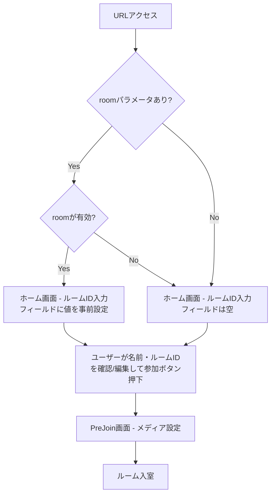

# 設計ドキュメント: URLクエリパラメータによるルームID事前設定

## 概要

本機能は、URLクエリパラメータ `?room={room名}` を使用して、ホーム画面のルームID入力フィールドに値を事前設定するシンプルな機能を提供する。

画面遷移フローの変更は行わない。ダイレクト入室やPreJoin画面への自動遷移は行わず、従来通りホーム画面を表示する。ユーザー名はCookieからのみ取得し、クエリパラメータでの名前指定はサポートしない。

変更対象は `App.tsx` のみ。`PreJoin.tsx` やサーバー側の変更は不要。

## アーキテクチャ

### 画面遷移フロー（変更なし）



画面遷移フローは既存のまま維持する。`?room=xxx` が付いていても、ホーム画面のルームID入力フィールドの初期値が変わるだけで、ユーザーは従来通り名前とルームIDを確認してから参加ボタンを押す。

### 変更対象コンポーネント

| コンポーネント | 変更内容 |
|---|---|
| `App.tsx` | クエリパラメータ解析ロジックの追加、`roomId` stateの初期値設定 |

## コンポーネントとインターフェース

### 1. クエリパラメータ解析関数（`parseRoomQueryParam`）

App.tsx内に定義する純粋関数。URLの `room` クエリパラメータを解析し、バリデーション済みのルーム名を返す。

```typescript
/**
 * URLクエリ文字列から `room` パラメータを解析し、バリデーション済みのルーム名を返す。
 * 無効な場合は null を返す。
 */
function parseRoomQueryParam(search: string): string | null;
```

バリデーションルール:
- 英数字、ハイフン、アンダースコアのみ許可（正規表現: `/^[a-zA-Z0-9_-]+$/`）
- 空文字の場合は `null` を返す
- 不正な文字を含む場合は `null` を返す
- `room` パラメータが存在しない場合は `null` を返す

### 2. App.tsx の変更

既存の `useEffect`（Cookie読み込み）を拡張し、初回レンダリング時にクエリパラメータも処理する。

```typescript
// 既存のuseEffectを拡張
useEffect(() => {
  // 既存: Cookieからユーザー名を読み込む
  const savedName = getCookie('userName');
  if (savedName) {
    setUserName(decodeURIComponent(savedName));
  }

  // 新規追加: クエリパラメータからルームIDを読み込む
  const roomFromUrl = parseRoomQueryParam(window.location.search);
  if (roomFromUrl) {
    setRoomId(roomFromUrl);
  }
}, []);
```

新規stateの追加は不要。既存の `roomId` stateの初期値をクエリパラメータから設定するだけ。

## データモデル

### クエリパラメータ

| パラメータ | 型 | 必須 | 説明 |
|---|---|---|---|
| `room` | string | No | ルーム名。英数字・ハイフン・アンダースコアのみ |

### Cookie（既存・変更なし）

| Cookie名 | 型 | 有効期限 | 説明 |
|---|---|---|---|
| `userName` | string (URLエンコード済み) | 365日 | ユーザー名の永続保存 |

### State変更（App.tsx）

既存のstate（`roomId`, `userName`, `inRoom`, `showPreJoin`, `mediaSettings`）はすべてそのまま維持。新規stateの追加なし。

## 正当性プロパティ

*プロパティとは、システムのすべての有効な実行において真であるべき特性や振る舞いのことである。プロパティは、人間が読める仕様と機械的に検証可能な正当性保証の橋渡しをする。*

### Property 1: ルーム名パースのラウンドトリップ

*For any* 英数字・ハイフン・アンダースコアのみで構成された非空文字列に対して、`?room={ルーム名}` 形式のクエリ文字列を構築し `parseRoomQueryParam` で解析した場合、返される値は元のルーム名と一致する。また、*for any* それ以外の文字を含む文字列、または空文字に対しては `null` を返す。

**Validates: Requirements 1.1, 1.2, 2.1, 2.2, 2.3**

## エラーハンドリング

| シナリオ | 処理 |
|---|---|
| `room` パラメータが不正な文字を含む | `parseRoomQueryParam` が `null` を返し、ルームID入力フィールドは空のまま |
| `room` パラメータが空文字 | `parseRoomQueryParam` が `null` を返し、ルームID入力フィールドは空のまま |
| クエリパラメータなしでアクセス | 既存のホーム画面フローをそのまま実行（ルームID入力フィールドは空） |

## テスト戦略

### プロパティベーステスト

ライブラリ: [fast-check](https://github.com/dubzzz/fast-check)（TypeScript向けプロパティベーステストライブラリ）

各プロパティテストは最低100回のイテレーションで実行する。

テスト対象の純粋関数:
- `parseRoomQueryParam(search: string): string | null`

各テストには以下の形式でタグコメントを付与する:
```
// Feature: url-room-join, Property {number}: {property_text}
```

プロパティテスト:
1. **Property 1**: 有効なルーム名（`/^[a-zA-Z0-9_-]+$/` にマッチする非空文字列）を生成し、`?room={ルーム名}` のクエリ文字列を構築してパース結果が元の値と一致することを確認。不正文字を含む文字列や空文字では `null` が返ることを確認。

### ユニットテスト

具体的なケースとエッジケースの検証:
- `?room=my-room` → `"my-room"`
- `?room=test_123` → `"test_123"`
- `?room=` （空文字）→ `null`（要件 2.2）
- `?room=my room` （スペース含む）→ `null`（要件 2.3）
- `?room=my/room` （スラッシュ含む）→ `null`（要件 2.3）
- クエリパラメータなし → `null`（要件 1.2）
- `?other=value` （roomパラメータなし）→ `null`（要件 1.2）
